# Lakerunner System Overview

## What Is Lakerunner

Lakerunner is a distributed telemetry ingestion and query engine that uses S3-compatible object storage as its primary data store. It processes OpenTelemetry data (logs, metrics, and eventually traces) through a batch pipeline that converts, indexes, and optimizes data into Apache Parquet format for analytical queries.

## System Architecture

### Core Design Principles

1. **Object Storage First**: All telemetry data lives in S3 as Parquet files
2. **Event-Driven Processing**: Kafka topics coordinate distributed work
3. **Columnar Analytics**: DuckDB executes SQL directly against Parquet files
4. **Metadata Indexing**: PostgreSQL maintains segment metadata for query planning
5. **Stateless Workers**: All services are horizontally scalable and ephemeral

### Data Flow Pipeline

The system is organized into distinct processing stages, each handling a specific aspect of the telemetry pipeline:

#### Event Notification & Routing



#### Data Ingestion



#### Segment Compaction



#### Metrics Rollup (Metrics-specific)



## Processing Pipeline

### Stage 1: Ingestion

The ingestion layer transforms raw telemetry into queryable Parquet segments:

**Input Formats:**

- OpenTelemetry Protocol (protobuf)
- JSON Lines (gzipped)
- CSV with headers
- Raw Parquet

**Processing Steps:**

1. File notification arrives via SQS/GCP Pub/Sub/Azure Event Grid/Webhook
2. PubSub service publishes to Kafka `ingest` topic
3. Ingest worker consumes job from Kafka
4. Worker reads raw data from S3
5. Data parsed and validated according to schema
6. Converted to columnar format
7. Written as Parquet segments to S3
8. Segment metadata registered in PostgreSQL index
9. Notifications sent to `boxer` topic for downstream processing

**Output Structure:**

```text
s3://bucket/
├── logs-cooked/
│   └── org_id=123/
│       └── dateint=20250114/
│           └── seg_<uuid>.parquet
├── metrics-cooked/
│   └── org_id=123/
│       └── dateint=20250114/
│           └── seg_<uuid>.parquet
```

### Stage 2: Compaction

Small segments are merged into larger, optimized files:

**Compaction Strategy:**

- Target size: 512MB-1GB per segment
- Triggers: File count threshold or age
- Deduplication by unique ID columns
- Re-sorting by timestamp for better compression
- Statistics recalculation for query optimization

**Implementation:**

1. Ingest workers send segment notifications to `boxer.compact` topic
2. Boxer-Compact service consumes unordered segment notifications
3. Groups segments into efficient work units based on size/time/count
4. Publishes grouped work to `compact.work` topic
5. Compact worker consumes work unit from Kafka
6. Reads multiple input segments from S3
7. Merges segments using streaming operations
8. Writes consolidated segment back to S3
9. Updates PostgreSQL index, marks originals for deletion

### Stage 3: Metric Rollups

Pre-aggregated metrics reduce query complexity:

**Rollup Granularities:**

- 1-minute (raw resolution)
- 5-minute (triggered by 1m completion)
- 1-hour (triggered by 5m completion)
- 1-day (triggered by 1h completion)

**Aggregation Functions:**

- Sum, Count, Min, Max, Avg
- Percentiles (p50, p95, p99)
- Cardinality estimates (HyperLogLog)

**Rollup Chain:**

1. Ingest workers send notifications to `boxer.rollup.metrics` topic
2. Boxer-Rollup service groups by time windows into work units
3. Publishes grouped work to `rollup.work` topic
4. Rollup worker consumes work unit from Kafka
5. Reads previous tier data from S3 (e.g., 10s granularity)
6. Aggregates into next tier (e.g., 60s granularity)
7. Writes rollup Parquet to S3
8. Registers segment in PostgreSQL index
9. Notifies next tier via `boxer.rollup` topic
10. Notifies compaction via `boxer.compact` topic

**Storage Layout:**

```text
metrics-rollup-5m/
└── org_id=123/
    └── dateint=20250114/
        └── rollup_<uuid>.parquet
```

## Query Architecture

### Query Planning

1. SQL query parsed and validated
2. Time range extracted for partition pruning
3. Segment index consulted for file list
4. Statistics used for further pruning
5. Query plan distributed to workers

### Query Execution

**DuckDB Integration:**

- Direct Parquet reading via S3 API
- Predicate pushdown to storage layer
- Vectorized execution engine
- Parallel scan across files
- Result streaming to client

**Query Types:**

- Time-series aggregations
- Full-text search (via Parquet strings)
- JOIN operations across data types
- Window functions for analytics

### Performance Optimizations

**File-Level:**

- Row group pruning via statistics
- Column projection (only read needed columns)
- Bloom filter evaluation for point lookups
- Dictionary encoding for repeated values

**System-Level:**

- Connection pooling to S3
- Query result caching (planned)
- Materialized views for common queries (planned)
- Adaptive query execution (planned)

## Service Components

### Core Services

**pubsub**

- Receives S3 event notifications
- Publishes to Kafka ingest topics
- Handles webhook/SQS integration
- Manages initial event routing

**ingest-logs / ingest-metrics**

- Consumes from Kafka ingest topics
- Schema validation and conversion
- Parquet generation with optimization
- Publishes compact/rollup jobs to Kafka

**boxer-compact-logs / boxer-compact-metrics**

- Consumes from Kafka compact topics
- Routes work to compact workers
- Schedules compaction batches
- Manages compaction policies

**compact-logs / compact-metrics**

- Segment merging logic
- Deduplication algorithms
- Statistics recalculation
- Publishes follow-up compact jobs

**boxer-rollup-metrics**
- Consumes from Kafka rollup topics
- Routes work to rollup workers
- Manages rollup scheduling
- Coordinates granularity chains

**rollup-metrics**
- Time-window aggregation
- Multi-granularity processing
- Publishes next-level rollup jobs
- Queues compact for completed levels

**sweeper**
- Expired segment cleanup
- Index maintenance
- Statistics updates
- Orphaned file detection

**monitor**
- Health check aggregation
- Performance metrics collection
- Alert generation
- SLA tracking

**query-api**
- SQL parsing and validation
- Query planning and optimization
- Result caching layer
- Client authentication

**query-worker**
- DuckDB execution engine
- S3 data retrieval
- Result materialization
- Memory management

## Distributed Coordination

### Kafka-Based Work Distribution

**Topic Structure:**

- `ingest` - Raw file notifications to process
- `boxer` - Segment notifications for downstream processing
- `boxer.compact` - Segments ready for compaction
- `boxer.rollup.metrics` - Metrics ready for rollup
- `compact.work` - Grouped compaction work units
- `rollup.work` - Grouped rollup work units

**Message Flow:**

1. **Event Notification**: PubSub publishes file paths to `ingest` topic
2. **Work Generation**: Ingest workers publish to `boxer.*` topics
3. **Work Grouping**: Boxer services batch into efficient work units
4. **Work Distribution**: Boxer publishes grouped work to `*.work` topics
5. **Processing**: Workers consume and process work units
6. **Chaining**: Completion may trigger additional `boxer.*` notifications

### Service Coordination

- **Boxer Services**: Transform unordered segment notifications into grouped work units
- **Worker Pools**: Consume work units and process in parallel
- **Singleton Services**: Sweeper uses leader election
- **Idempotency**: All operations are idempotent for at-least-once delivery

## Performance Characteristics

### Ingestion Performance

- **Throughput**: 10-100K events/second per worker
- **Latency**: 1-5 minutes from upload to queryable
- **Parallelism**: Limited by S3 PUT rate (3,500 req/s)
- **Memory**: 2-4GB per worker for buffering

### Query Performance

- **Recent Data**: <1 second (in-memory cache)
- **Historical**: 1-10 seconds (S3 reads)
- **Aggregations**: Sub-second with rollups
- **Full Scans**: Linear with data volume

### Storage Characteristics

- **Compression**: 5-10x reduction from raw
- **Partitioning**: By organization and date
- **File Size**: 512MB-1GB optimal
- **Format**: Parquet with ZSTD

## Operational Considerations

### Monitoring

- Prometheus metrics on all services
- Distributed tracing with OpenTelemetry
- Health endpoints: `/healthz`, `/readyz`, `/livez`
- Work queue depth monitoring
- S3 operation latency tracking

### Failure Modes

**S3 Unavailability**
- Workers pause with exponential backoff
- Queries fail gracefully with partial results
- Work queue continues accepting jobs

**PostgreSQL Outage**
- New ingestion stops
- Existing queries continue via cached metadata
- System enters degraded mode

**Worker Failures**
- Work items reclaimed after timeout
- No data loss (idempotent operations)
- Automatic scale-up via HPA

### Deployment Model

**Kubernetes Native**
- StatefulSet for sweeper (singleton)
- Deployments for all other services
- HorizontalPodAutoscaler for workers
- PodDisruptionBudgets for availability
- NetworkPolicies for security

**Resource Requirements**
```yaml
ingest-worker:
  cpu: 2-4 cores
  memory: 4-8 GB
  replicas: 3-10

query-worker:
  cpu: 4-8 cores
  memory: 8-16 GB
  replicas: 5-20

postgresql:
  cpu: 8-16 cores
  memory: 32-64 GB
  storage: 500GB-2TB SSD
```

## Future Architecture

### Planned Enhancements

**Query Layer**
- Distributed query coordination
- Result caching with TTL
- Materialized views
- Cost-based optimizer

**Storage Layer**
- Tiered storage (hot/warm/cold)
- Delta Lake format support
- Compaction policies per tier
- Encryption key management

**Processing Layer**
- Stream processing integration
- Real-time alerting (<1 minute)
- Custom aggregation functions
- Machine learning pipelines

### Trace Support (In Development)

- Span relationship modeling
- Distributed trace assembly
- Latency-optimized storage format
- Service dependency mapping
