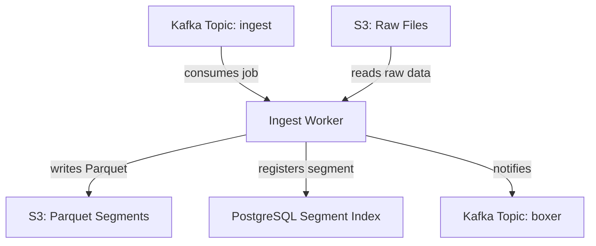
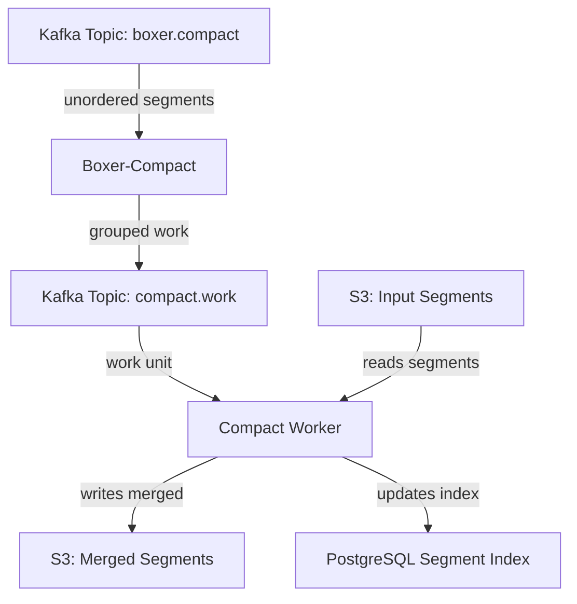

# Logs Architecture

Log processing converts raw log data into optimized Parquet segments with fingerprinting for pattern analysis.

## Pipeline Overview



## Input Formats

The log ingest worker accepts multiple input formats:

| Format | Description |
| ------ | ----------- |
| **OpenTelemetry** | OTLP protobuf with resource, scope, and log record attributes |
| **JSON Lines** | Gzipped JSON with flexible schema |
| **CSV** | Structured data with headers |
| **Parquet** | Pass-through for pre-formatted data |

## Schema Discovery

Log schemas are **transactional** and discovered per-file:

1. Read input file and discover actual structure
2. Flatten OTEL resource/scope/record attributes into columns
3. Apply schema merging with type promotion during compaction
4. Normalize values to match merged schema types

## Parquet Schema

Logs use a flattened schema with prefixed attributes:

### System Fields

| Field | Type | Description |
| ----- | ---- | ----------- |
| `chq_id` | string | Unique record identifier |
| `chq_timestamp` | int64 | Milliseconds since Unix epoch |
| `chq_tsns` | int64 | Original timestamp in nanoseconds |
| `chq_fingerprint` | int64 | Message pattern fingerprint |
| `chq_telemetry_type` | string | Always `"logs"` |

### Log Fields

| Field | Type | Description |
| ----- | ---- | ----------- |
| `log_level` | string | Severity (TRACE, DEBUG, INFO, WARN, ERROR, FATAL) |
| `log_message` | string | Human-readable log content |
| `metric_name` | string | Always `"log_events"` |

### Attribute Prefixes

| Prefix | Source |
| ------ | ------ |
| `resource_*` | OTEL Resource attributes (deployment/infrastructure) |
| `scope_*` | OTEL InstrumentationScope attributes |
| `attr_*` | Log record attributes |

## Fingerprinting

The fingerprint groups similar log messages for pattern analysis:

1. Extract message content from log body
2. Remove variable content (IPs, IDs, timestamps, process IDs)
3. Hash normalized string to produce `chq_fingerprint`

Messages with the same fingerprint represent the same log pattern with different variable values.

## Sorting Strategy

Log segments are sorted by `[service_identifier, fingerprint, timestamp]`:

- **service_identifier**: `resource_customer_domain` if set, otherwise `resource_service_name`
- **fingerprint**: Groups similar log patterns together
- **timestamp**: Chronological ordering within groups

This layout optimizes queries that filter by service and pattern.

## Compaction

Small log segments are merged into larger files:



### Compaction Strategy

- **Target size**: 512MB–1GB per segment
- **Deduplication**: By `chq_id` to remove duplicates
- **Re-sorting**: Maintains sort order for query optimization
- **Statistics**: Recalculated for partition pruning

## Storage Layout

```
logs-cooked/
└── org_id=123/
    └── dateint=20250114/
        └── seg_<uuid>.parquet
```

Partitioned by organization and date for efficient pruning.

## Query Patterns

Common log query patterns optimized by this layout:

| Query Type | Optimization |
| ---------- | ------------ |
| Time range | Date partition pruning |
| Service filter | Sorted by service_identifier |
| Pattern search | Sorted by fingerprint |
| Full-text | Column scan with predicate pushdown |

## Services

| Service | Role |
| ------- | ---- |
| **ingest-logs** | Schema discovery, fingerprinting, Parquet generation |
| **boxer-compact-logs** | Groups segments for compaction |
| **compact-logs** | Merges and deduplicates segments |

## Next Steps

- [Metrics Architecture](./metrics.md) – Metrics pipeline with rollups
- [Traces Architecture](./traces.md) – Trace processing and span fingerprinting
