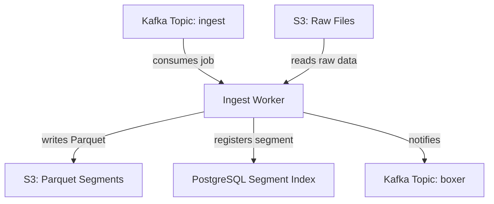
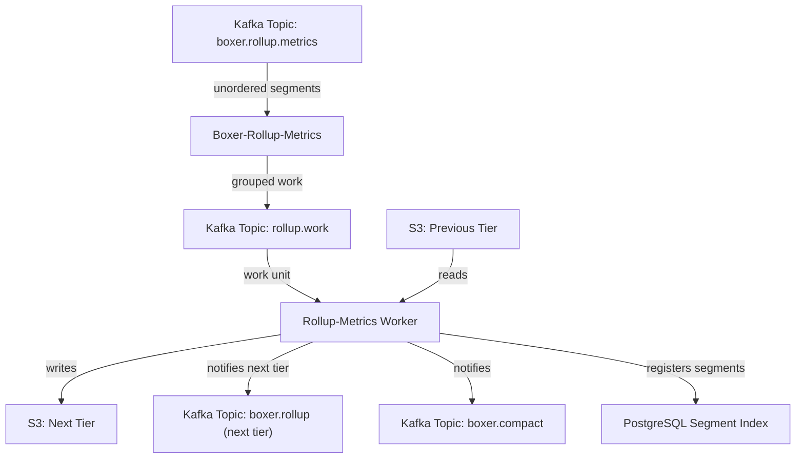
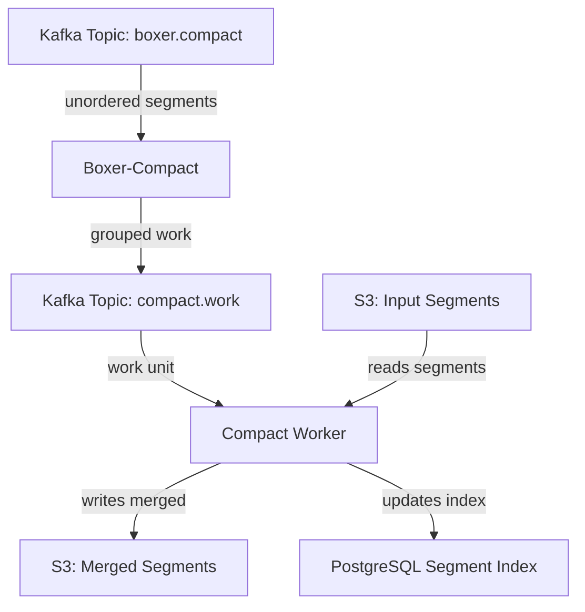

# Metrics Architecture

Metrics processing converts raw time-series data into Parquet with DDSketch encoding and multi-tier rollups.

## Pipeline Overview



## Input Formats

Metrics ingest supports standard OTEL metric types:

| OTEL Type | Internal Type | Description |
| --------- | ------------- | ----------- |
| Gauge | `gauge` | Point-in-time values |
| Sum | `count` | Cumulative or delta counters |
| Histogram | `histogram` | Explicit bucket distributions |
| ExponentialHistogram | `histogram` | Logarithmic bucket distributions |
| Summary | `histogram` | Pre-computed quantiles |

## DDSketch Encoding

All metric values are encoded as DDSketch (DataDog Sketch) for accurate percentile calculations:

- Single-value metrics (gauge/sum): Sketch contains one value
- Histograms: Distribution reconstructed from bucket counts
- Enables percentile merging across aggregated data

## Parquet Schema

### System Fields

| Field | Type | Description |
| ----- | ---- | ----------- |
| `chq_tid` | int64 | Time-series ID (FNV-1a hash) |
| `chq_timestamp` | int64 | Milliseconds since Unix epoch (10s aligned) |
| `chq_tsns` | int64 | Original timestamp in nanoseconds |
| `chq_metric_type` | string | `gauge`, `count`, or `histogram` |
| `chq_sketch` | bytes | Serialized DDSketch |
| `chq_customer_id` | string | Organization ID |
| `chq_telemetry_type` | string | Always `"metrics"` |

### Rollup Fields

Pre-computed statistics extracted from the DDSketch:

| Field | Description |
| ----- | ----------- |
| `chq_rollup_avg` | Average value (sum/count) |
| `chq_rollup_count` | Number of observations |
| `chq_rollup_min` | Minimum value |
| `chq_rollup_max` | Maximum value |
| `chq_rollup_sum` | Sum of all values |
| `chq_rollup_p25` | 25th percentile |
| `chq_rollup_p50` | 50th percentile (median) |
| `chq_rollup_p75` | 75th percentile |
| `chq_rollup_p90` | 90th percentile |
| `chq_rollup_p95` | 95th percentile |
| `chq_rollup_p99` | 99th percentile |

### Metadata Fields

| Field | Type | Description |
| ----- | ---- | ----------- |
| `metric_name` | string | Normalized metric name |
| `chq_description` | string | Metric description |
| `chq_unit` | string | Unit (e.g., "ms", "By") |
| `chq_scope_name` | string | Instrumentation scope name |

### Attribute Filtering

Unlike logs, metrics apply strict resource attribute filtering to reduce cardinality:

**Retained resource attributes:**
- `resource_service_name`
- `resource_service_version`
- `resource_k8s_*` (cluster, namespace, pod, deployment, etc.)
- `resource_container_image_*`
- `resource_app`

Datapoint attributes are retained with `attr_*` prefix.

## Time-Series ID (TID)

The TID uniquely identifies a metric time series. Computed from:

1. Normalized metric name
2. Metric type
3. Filtered resource attributes
4. Datapoint attributes

All datapoints with the same TID belong to the same time series.

## Sorting Strategy

Metrics are sorted by `[metric_name, chq_tid, chq_timestamp]`:

- Groups datapoints by metric for efficient queries
- Keeps time series together for range scans
- Chronological ordering within each series

## Rollup Pipeline

Pre-aggregated metrics reduce query time for dashboards:



### Rollup Chain

Each tier triggers the next upon completion:

| Granularity | Trigger |
| ----------- | ------- |
| 10-second | Raw data arrival |
| 1 minute | 10-second data arrival |
| 5 minutes | 1-minute completion |
| 20 minutes | 5-minute completion |
| 1 hour | 20-minute completion |

### Aggregation

Rollups aggregate by TID within each time window:

- DDSketches merged for accurate percentiles
- Count, sum, min, max computed from merged data
- Original raw data retained for detailed queries

## Compaction



Both raw and rollup segments are compacted.

## Storage Layout

```
metrics-cooked/
└── org_id=123/
    └── dateint=20250114/
        └── seg_<uuid>.parquet

metrics-rollup-60s/
└── org_id=123/
    └── dateint=20250114/
        └── rollup_<uuid>.parquet

metrics-rollup-5m/
metrics-rollup-20m/
metrics-rollup-1h/
```

## Query Patterns

| Query Type | Data Source | Optimization |
| ---------- | ----------- | ------------ |
| Last 1 hour | 10s/60s data | Recent segments |
| Last 24 hours | 5m rollups | Reduced scan |
| Last 7 days | 20m rollups | Efficient aggregation |
| Last 30 days | 1h rollups | Minimal I/O |

## Services

| Service | Role |
| ------- | ---- |
| **ingest-metrics** | DDSketch encoding, TID generation, Parquet writing |
| **boxer-compact-metrics** | Groups segments for compaction |
| **compact-metrics** | Merges segments by TID |
| **boxer-rollup-metrics** | Groups metrics by time window for rollup |
| **rollup-metrics** | Aggregates metrics into coarser granularities |

## Next Steps

- [Logs Architecture](./logs.md) – Log processing pipeline and fingerprinting
- [Traces Architecture](./traces.md) – Trace processing and span fingerprinting
