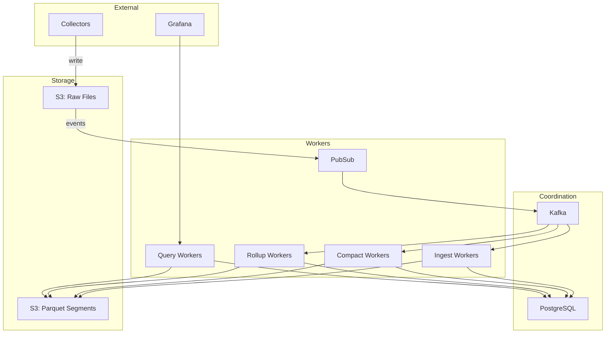
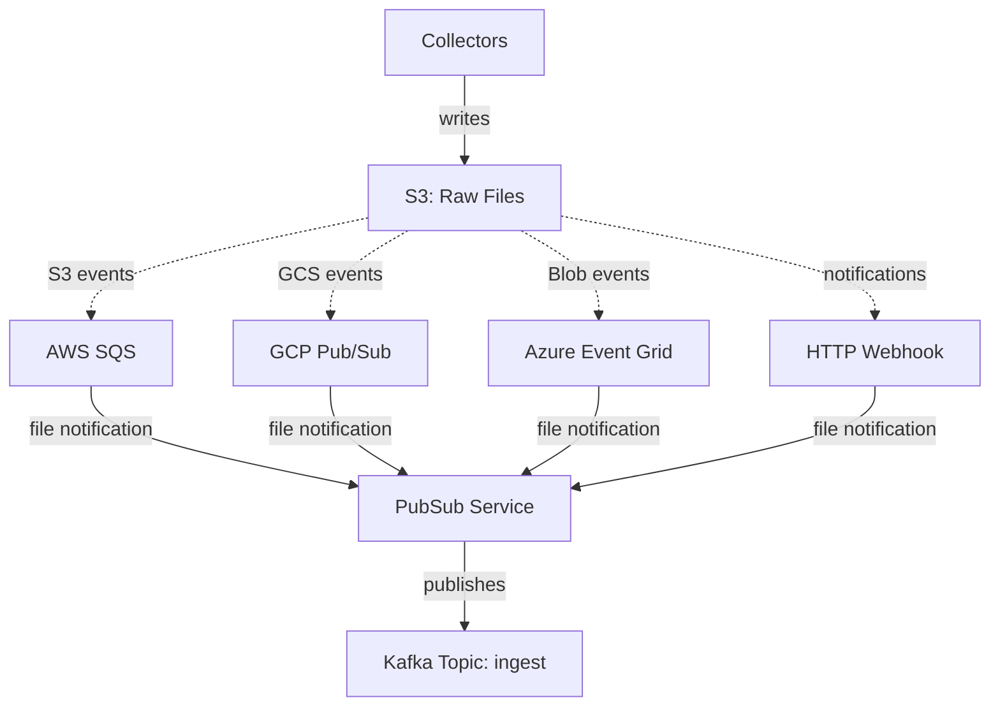
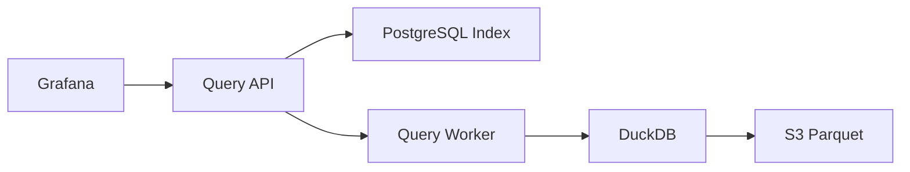

# Architecture Overview

Lakerunner processes three types of telemetry data through a common event-driven pipeline with type-specific optimizations.

## Design Principles

1. **Object Storage First** – All telemetry data lives in S3 as Parquet files
2. **Event-Driven Processing** – Kafka topics coordinate distributed work
3. **Columnar Analytics** – DuckDB executes queries directly against Parquet
4. **Metadata Indexing** – PostgreSQL maintains segment metadata for query planning
5. **Stateless Workers** – All services are horizontally scalable and ephemeral

## Common Pipeline

All data types share the same event notification and ingestion entry point:



## Event Notification

When collectors write raw telemetry to object storage, the store emits notifications. The PubSub service receives these and publishes to Kafka:



## Data Type Processing

Each telemetry type has specialized processing:

| Data Type | Ingestion | Compaction | Additional Processing |
| --------- | --------- | ---------- | --------------------- |
| [Logs](./logs.md) | Schema discovery, fingerprinting | Merge and dedupe | Log pattern analysis |
| [Metrics](./metrics.md) | DDSketch encoding, TID generation | Merge by time series | Multi-tier rollups |
| [Traces](./traces.md) | Span fingerprinting | Merge by trace | Service mapping |

## Query Path



1. Query API parses SQL and extracts time ranges
2. Segment index consulted for partition pruning
3. Query plan distributed to workers
4. DuckDB reads Parquet directly from S3
5. Results streamed back to client

## Storage Layout

```
s3://bucket/
├── logs-raw/           # Raw collector output
├── logs-cooked/        # Processed Parquet segments
│   └── org_id=123/
│       └── dateint=20250114/
│           └── seg_<uuid>.parquet
├── metrics-raw/
├── metrics-cooked/
├── metrics-rollup-60s/
├── metrics-rollup-5m/
├── metrics-rollup-20m/
├── metrics-rollup-1h/
├── traces-raw/
└── traces-cooked/
```

## Service Summary

| Service | Role |
| ------- | ---- |
| **pubsub** | Receives S3 notifications, publishes to Kafka |
| **ingest-logs** | Converts raw logs to Parquet with fingerprinting |
| **ingest-metrics** | Converts raw metrics to Parquet with DDSketch |
| **ingest-traces** | Converts raw spans to Parquet |
| **boxer-compact** | Groups segments for compaction |
| **compact-logs/metrics/traces** | Merges small segments |
| **boxer-rollup-metrics** | Groups metrics for rollup |
| **rollup-metrics** | Pre-aggregates metrics by time window |
| **sweeper** | Cleans up expired segments |
| **query-api** | SQL parsing and query planning |
| **query-worker** | DuckDB execution against Parquet |

## Next Steps

- [Logs Architecture](./logs.md) – Log processing pipeline and fingerprinting
- [Metrics Architecture](./metrics.md) – Metrics pipeline with rollups
- [Traces Architecture](./traces.md) – Trace processing and span fingerprinting
