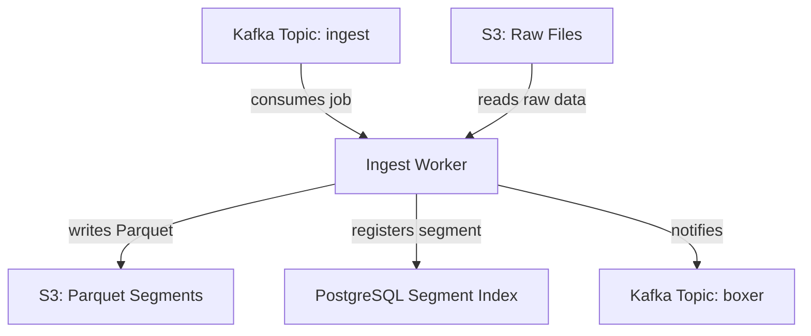
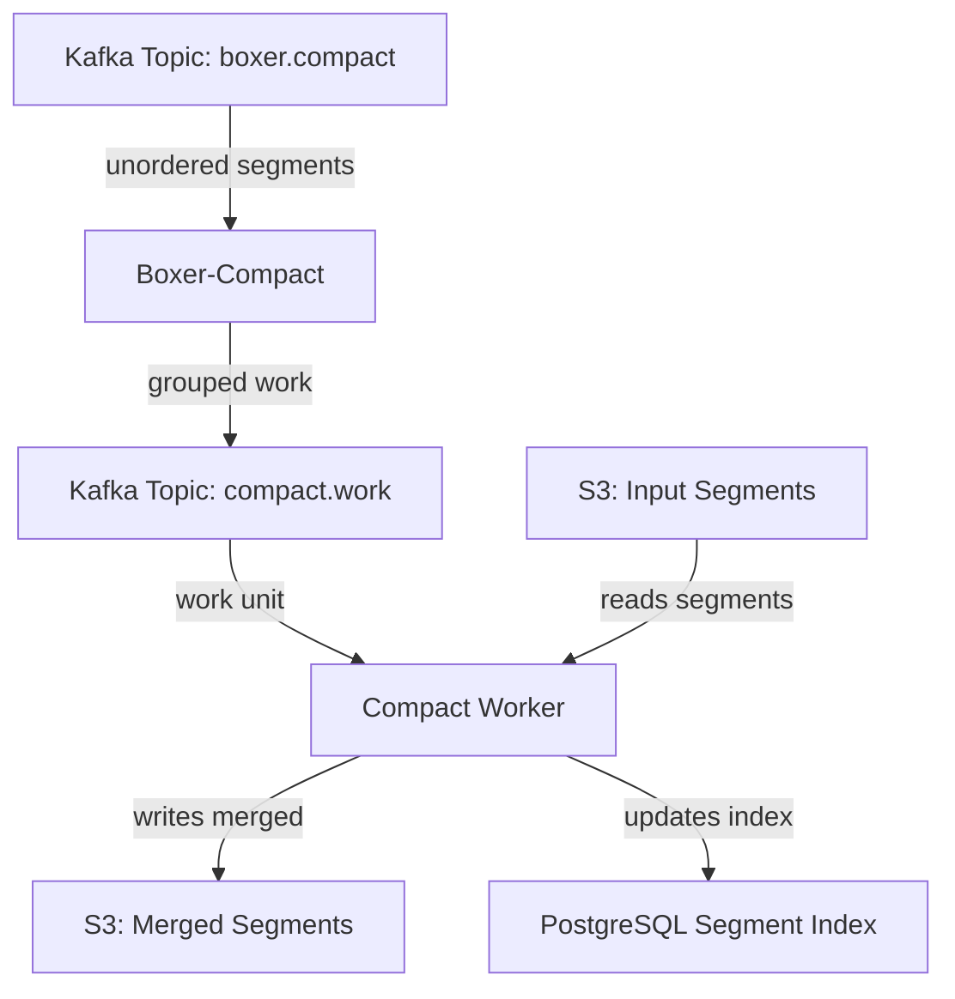

# Traces Architecture

Trace processing converts distributed spans into Parquet with semantic fingerprinting for service analysis.

## Pipeline Overview



## Input Format

Traces ingest accepts OpenTelemetry span data with:

- Trace and span identifiers
- Parent-child relationships
- Timing information (start, end, duration)
- Status codes and messages
- Resource, scope, and span attributes

## Parquet Schema

### Span Fields

| Field | Type | Description |
| ----- | ---- | ----------- |
| `span_trace_id` | string | 32-char hex trace identifier |
| `span_id` | string | 16-char hex span identifier |
| `span_parent_span_id` | string | Parent span ID (empty for root spans) |
| `span_name` | string | Operation name |
| `span_kind` | string | Relationship type (see below) |
| `span_status_code` | string | Operation status |
| `span_status_message` | string | Status message (typically on errors) |
| `span_end_timestamp` | int64 | End time in milliseconds |
| `span_duration` | int64 | Duration in milliseconds |

### Span Kinds

| Kind | Description |
| ---- | ----------- |
| `SPAN_KIND_UNSPECIFIED` | Relationship unknown |
| `SPAN_KIND_INTERNAL` | Internal application operation |
| `SPAN_KIND_SERVER` | Server side of synchronous RPC |
| `SPAN_KIND_CLIENT` | Client side of synchronous RPC |
| `SPAN_KIND_PRODUCER` | Initiator of async request |
| `SPAN_KIND_CONSUMER` | Receiver of async request |

### Status Codes

| Status | Description |
| ------ | ----------- |
| `STATUS_CODE_UNSET` | Default status |
| `STATUS_CODE_OK` | Operation succeeded |
| `STATUS_CODE_ERROR` | Operation failed |

### System Fields

| Field | Type | Description |
| ----- | ---- | ----------- |
| `chq_id` | string | Unique row identifier |
| `chq_timestamp` | int64 | Span start time in milliseconds |
| `chq_tsns` | int64 | Span start time in nanoseconds |
| `chq_fingerprint` | int64 | Semantic span fingerprint |
| `chq_telemetry_type` | string | Always `"traces"` |

### Attribute Prefixes

| Prefix | Source |
| ------ | ------ |
| `resource_*` | OTEL Resource attributes |
| `scope_*` | OTEL InstrumentationScope attributes |
| `attr_*` | Span attributes |

## Span Fingerprinting

The fingerprint groups semantically similar spans. Computed using xxhash with pattern-specific logic.

### Base Components

All fingerprints include:

1. `resource_k8s_cluster_name` (or "unknown")
2. `resource_k8s_namespace_name` (or "unknown")
3. `resource_service_name` (or "unknown")
4. `span_kind`

### Pattern Detection

Additional components based on span type (checked in order):

**Messaging Pattern** (when `attr_messaging_system` present):
- `attr_messaging_system` (kafka, rabbitmq, etc.)
- `attr_messaging_operation_type` (publish, receive)
- `attr_messaging_destination_name` (queue/topic name)

**Database Pattern** (when `attr_db_system_name` present):
- `span_name`
- `attr_db_system_name` (postgresql, mysql, etc.)
- `attr_db_namespace` (database name)
- `attr_db_operation_name` (SELECT, INSERT, etc.)
- `attr_server_address`
- `attr_db_collection_name` (table name)

**HTTP Pattern** (when `attr_http_request_method` present):
- `attr_http_request_method` (GET, POST, etc.)
- `attr_url_template` (URL pattern)

**Default Pattern**:
- `span_name`

## Sorting Strategy

Traces are sorted by `[span_trace_id, chq_timestamp]`:

- Groups all spans of a trace together
- Orders spans chronologically within each trace
- Optimizes trace assembly queries

## Compaction



### Compaction Strategy

- **Target size**: 512MB–1GB per segment
- **Deduplication**: By `chq_id`
- **Re-sorting**: By trace ID and timestamp

## Storage Layout

```
traces-cooked/
└── org_id=123/
    └── dateint=20250114/
        └── seg_<uuid>.parquet
```

## Query Patterns

| Query Type | Optimization |
| ---------- | ------------ |
| Trace lookup | Sorted by trace_id |
| Time range | Date partition pruning |
| Service filter | Fingerprint grouping |
| Error analysis | Status code filtering |
| Latency analysis | Duration field + fingerprint |

## Common Attributes

### Resource Attributes

| Attribute | Description |
| --------- | ----------- |
| `resource_service_name` | Service that generated the span |
| `resource_service_version` | Service version |
| `resource_k8s_cluster_name` | Kubernetes cluster |
| `resource_k8s_namespace_name` | Kubernetes namespace |
| `resource_k8s_pod_name` | Kubernetes pod |

### HTTP Span Attributes

| Attribute | Description |
| --------- | ----------- |
| `attr_http_request_method` | HTTP method |
| `attr_url_template` | URL pattern |
| `attr_http_response_status_code` | HTTP status code |

### Database Span Attributes

| Attribute | Description |
| --------- | ----------- |
| `attr_db_system_name` | Database type |
| `attr_db_namespace` | Database name |
| `attr_db_operation_name` | Operation type |
| `attr_db_collection_name` | Table/collection |
| `attr_server_address` | Database host |

### Messaging Span Attributes

| Attribute | Description |
| --------- | ----------- |
| `attr_messaging_system` | Messaging system |
| `attr_messaging_operation_type` | Operation type |
| `attr_messaging_destination_name` | Queue/topic name |

## Services

| Service | Role |
| ------- | ---- |
| **ingest-traces** | Span fingerprinting, Parquet generation |
| **boxer-compact-traces** | Groups segments for compaction |
| **compact-traces** | Merges and deduplicates segments |

## Next Steps

- [Logs Architecture](./logs.md) – Log processing pipeline and fingerprinting
- [Metrics Architecture](./metrics.md) – Metrics pipeline with rollups
