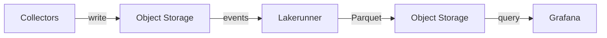

# Cardinal Lakerunner

Cardinal Lakerunner is an event-driven ingestion engine that converts telemetry data into Apache Parquet and stores it in object storage. It handles indexing, aggregation, and compaction automatically.

## Features

- **Logs and metrics ingestion** with automatic Parquet conversion
- **Metric rollups** at multiple granularities (10s, 1m, 5m, 20m, 1h)
- **Segment compaction** for optimized storage and query performance
- **Distributed processing** with stateless workers designed for spot instances
- **Grafana integration** with native datasource plugin

## Infrastructure Requirements

Lakerunner requires three infrastructure components:

| Component | Purpose | Examples |
| --------- | ------- | -------- |
| **Object Storage** | Data storage (raw and processed) | AWS S3, GCS, Azure Blob, MinIO, Ceph |
| **Message Queue** | Work coordination between workers | Kafka, Redpanda, Amazon MSK |
| **Relational Database** | Segment metadata index | PostgreSQL 17+ |

## Compute Model

All Lakerunner workers are **stateless** and designed to run on **spot/preemptible instances**:

- Workers can be interrupted and restarted without data loss
- Work items are distributed via message queue with at-least-once delivery
- Horizontal scaling based on queue depth

## Cloud Provider Support

| Provider | Storage | Event Notifications |
| -------- | ------- | ------------------- |
| **AWS** | S3 | SQS |
| **GCP** | Cloud Storage | Pub/Sub |
| **Azure** | Blob Storage | Event Grid |
| **Private Cloud** | MinIO, Ceph, etc. | Webhook |

## Supported Input Formats

| Format | Description |
| ------ | ----------- |
| **OpenTelemetry** | OTLP protobuf (logs and metrics) |
| **JSON Lines** | Gzipped JSON |
| **CSV** | Structured data with headers |
| **Parquet** | Pass-through for pre-formatted data |

## How It Works

1. **Collect** – Collectors write telemetry to object storage
2. **Ingest** – Lakerunner receives storage event notifications and converts data to Parquet
3. **Optimize** – Spot workers compact segments and compute metric rollups
4. **Query** – Grafana queries data via the Lakerunner datasource plugin

## License

Open source under AGPL-3.0. Source: [GitHub](https://github.com/cardinalhq/lakerunner)

## Next Steps

- [Architecture Overview](./architecture/overview.md) – System design and data flow
- [Configuration](./configuration/storage-profiles.md) – Storage profiles and credentials
- [Operations](./operations/health-checks.md) – Health checks and monitoring
